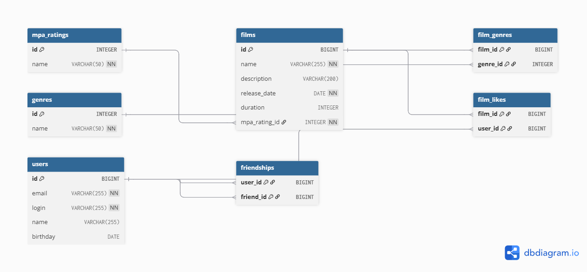

# Filmorate

**Filmorate** — это бэкенд-приложение на Spring Boot для сервиса, который позволяет пользователям выбирать фильмы на основе рейтингов и симпатий других людей. Проект объединяет функциональность социальной сети и базы данных кино.

## Функциональные возможности

### Фильмы
*   **Добавление и обновление**: хранение информации о названии, описании, дате релиза и продолжительности.
*   **Рейтинг популярных**: возможность просматривать топ-N самых популярных фильмов на основе лайков.
*   **Жанры и MPA**: поддержка классификации фильмов по жанрам и возрастным рейтингам Ассоциации кинокомпаний (G, PG, PG-13, R, NC-17).

### Пользователи
*   **Управление профилем**: регистрация пользователей с валидацией почты, логина и даты рождения.
*   **Дружба**: система заявок в друзья с механизмом подтверждения (двусторонний статус).
*   **Общие интересы**: поиск общих друзей с другими пользователями.

## Технологический стек
*   **Java 21**
*   **Spring Boot**
*   **Lombok**
*   **JUnit 5**
*   **Maven**

## Схема базы данных


## Примеры запросов для основных операций
### Пользователи
*   **Получение всех пользователей**
    ```sql
    SELECT * FROM users ORDER BY id;
    ```
*   **Получение данных пользователя по ID (например, ID = 1):**
    ```sql
    SELECT * FROM users WHERE id = 1;
    ```
*   **Список друзей пользователя:**
    ```sql
    SELECT u.*
    FROM users u
    JOIN friendships f ON u.id = f.friend_id
    WHERE f.user_id = 1;
    ```
### Фильмы
*   **Получение всех фильмов с их рейтингом MPA:**
    ```sql
    SELECT f.id, f.name, f.description, f.duration, f.release_date, 
    m.id AS mpa_id, m.name AS mpa_name
    FROM films f
    JOIN mpa_ratings m ON f.mpa_rating_id = m.id
    ORDER BY f.id;
    ```
*   **Топ-10 самых популярных фильмов по количеству лайков:**
    ```sql
    SELECT f.*, m.name AS mpa_name, COUNT(fl.user_id) AS likes_count
    FROM films f
    LEFT JOIN mpa_ratings m ON f.mpa_rating_id = m.id
    LEFT JOIN film_likes fl ON f.id = fl.film_id
    GROUP BY f.id
    ORDER BY likes_count DESC
    LIMIT 10;
    ```
*   **Получение всех жанров конкретного фильма (например, ID = 5):**
    ```sql
    SELECT g.id, g.name
    FROM genres g
    JOIN film_genres fg ON g.id = fg.genre_id
    WHERE fg.film_id = 5
    ORDER BY g.id;
    ```
